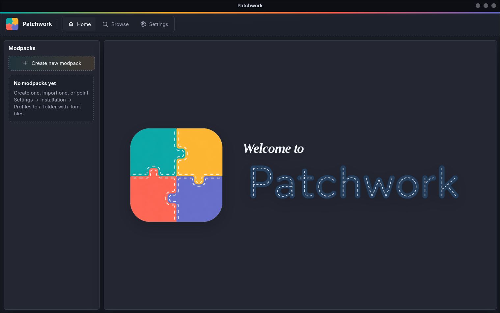

# Patchwork

Patchwork is an experimental source-level modding system for Rust software.
Instead of loading binary plugins at runtime, Patchwork composes a list of mods into a
normal Cargo project and then compiles the game.

<div align="center">
  
</div>

The core idea is:

> Instead of having a "base game" and adding mods on top, the entire game is entirely composed by mods, stringed together at compiled time in a single project. Every single mechanic or object in the game is a distinct mod. Mods depend on eachother and can be swapped with other implementations. This architecture results in a game that is fully customizable and moddable in every aspect, and the player has complete choice over its contents.

Checkout the documentation (Coming Soon).

## Project layout

```text
modding_system/
  patchwork/       core composition library
  patchwork-cli/   CLI exposing `patchwork compose`
  patchwork-app/   Tauri + Leptos desktop launcher
  template/        base executable project copied into composed projects
  documentation/   mdBook documentation
```

A game or application using Patchwork usually has:

```text
my_game/
  mods/
  modpacks/
  build/
```

## Mod metadata

Each selectable mod is a Cargo crate with metadata in its `Cargo.toml`:

```toml
[package.metadata.mod]
entry = "EntryType"
provides = "optional-api-name"

[package.metadata.mod.dependencies]
init = []
run = []
ownership = []
```

- `entry`: Rust type used by the generated glue code.
- `provides`: optional API name implemented by this mod.
- `init`: dependencies passed to `EntryType::init()` as `&mut T`.
- `run`: dependencies passed to `EntryType::run()` as `Arc<T>`.
- `ownership`: dependencies moved into `run()` by value.

Patchwork does not require a shared Rust trait for mods yet. The generated
project calls `EntryType::init(...)` and `EntryType::run(...)` directly; Rust
then type-checks the composed program.

## APIs and providers

API crates contain traits and shared types. A concrete mod can provide an API:

```toml
[package.metadata.mod]
entry = "StdCommandProcessorMod"
provides = "command-api"
```

Other mods can depend on `"command-api"` in `init`, `run` or `ownership`.
The selected modpack must contain exactly one provider for each required API.
This gives compile-time dependency injection: the modpack chooses the concrete
implementation and Rust checks the result.

## Modpacks

A modpack is a TOML file selecting mods and importing other modpacks:

```toml
name = "Client"
description = "Client-side modpack."
color = "#02a9a9"
modpacks = ["common"]
ignore = []

mods = [
    "main-client-mod",
    "network-client-impl",
]
```

Fields:

- `name`, `description`: launcher/browser metadata.
- `color`: optional selected color in the launcher.
- `modpacks`: imported modpacks.
- `mods`: explicitly selected mods.
- `ignore`: mods removed from the imported dependency tree.

Patchwork also supports the legacy reference form `modpack/common` inside
`mods`, `init`, `run` and `ownership`, but the top-level `modpacks = [...]`
field is preferred for modpack imports.

## Codegen

Mods can declare generated crates:

```toml
[[package.metadata.mod.codegen]]
crate = "items-generated"
version = "0.1.0"
dev_crate = "items-generated"

[package.metadata.mod.codegen.generator]
crate = "items-codegen-utils"
command = "generate"
```

Patchwork only launches the generator and patches the generated crate into the
composed Cargo project. The meaning of the generated code is owned by the
domain mod. For example, a network generator may aggregate all message types
exported by independent message mods.

## Assets and favicons

If a selected mod contains an `assets/` directory, Patchwork copies it into the
composed project as:

```text
assets/<mod-name>/
```

This keeps asset paths isolated between mods.

The launcher also uses filesystem favicon conventions:

- `mods/<mod>/favicon.png` (or `.jpg`, `.jpeg`, `.webp`, `.gif`) for a mod;
- `modpacks/<id>.png` (or supported image extension) for `<id>.toml`.

Favicons are visual metadata only; they do not affect composition.

## CLI

```bash
patchwork compose \
  --mods-folder mods \
  --modpacks-folder modpacks \
  --modpack client \
  --cache build \
  --name client
```

The output is a normal Cargo project:

```bash
cargo check --manifest-path build/client/Cargo.toml
```